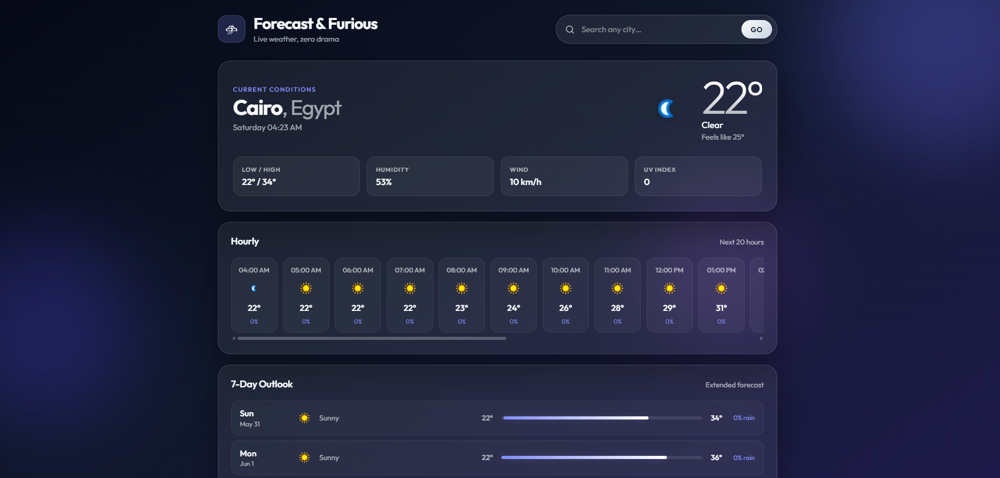

# Weather App

Full-stack weather app built with React, Vite, and Express.

## Prerequisites

- Node.js 18+
- [WeatherAPI](https://www.weatherapi.com/) key

## Local development

### 1. Backend

```bash
cd server
cp .env.example .env
# Add your WeatherAPI key to .env:
# API_KEY=your_api_key_here
npm install
npm run dev
```

### 2. Frontend

```bash
cd frontend
npm install
npm run dev
```

The frontend development server proxies `/api` requests to `http://localhost:5000`.

## Production build

```bash
cd frontend
npm install
npm run build

cd ../server
npm install
cp .env.example .env
# Set NODE_ENV=production, API_KEY, and CLIENT_URL in .env
npm start
```

In production, the Express server:

- serves the built React app from `frontend/dist`
- exposes `/api/weather` and `/api/health`

## API endpoints

- `GET /api/health`
- `GET /api/weather?city=<city-name>`

## Environment variables

| Variable       | Where    | Description                                         |
| -------------- | -------- | --------------------------------------------------- |
| `API_KEY`      | server   | WeatherAPI key (required)                           |
| `PORT`         | server   | Server port (default: `5000`)                       |
| `NODE_ENV`     | server   | Set to `production` to serve the built frontend     |
| `CLIENT_URL`   | server   | Optional comma-separated allowed origin(s) for CORS |
| `VITE_API_URL` | frontend | Optional API base URL for split deployments         |

## Notes

- The backend uses `node index.js` for both `npm run dev` and `npm start`.
- The frontend proxy is configured in `frontend/vite.config.js`.
- Do not commit `.env` files or secrets to source control.
- If `CLIENT_URL` is set in production, requests must originate from an allowed origin.



